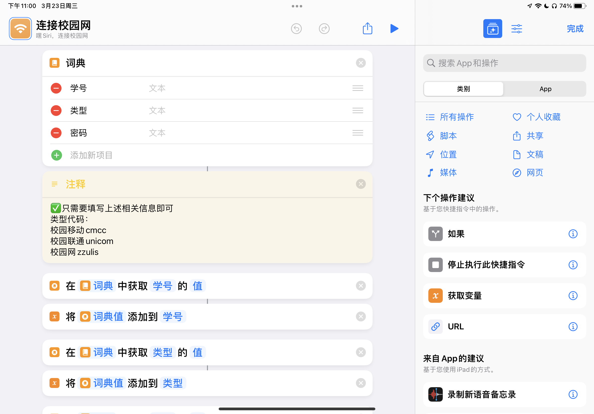

### Windows / iOS / iPad / Mac 自动连接校园网

以下是ZZULI的使用方法，其他院校仅供参考，不保证可用性。

✅2022-11-20 添加[客户端自动拨号](#客户端自动拨号)

✅2022-3-22 添加[Apple快捷指令](#Apple快捷指令)

✅2022-3-17 添加[Web网页认证](#Web网页认证)

### Web网页认证

下载web.py代码到本地，然后编写cmd命令，你需要修改的部分：（大约在9-11行）

```python
user_account = ''  # 账号
user_type = ''  # 类型
user_pwd = ''  # 密码
```

| 类型     | 类型代码 |
| -------- | :------- |
| 中国移动 | cmcc     |
| 中国联通 | unicom   |
| 校园网   | zzulis   |

cmd命令示范：

```shell
@echo off
cd E:\Program Projects\PycharmProjects\AutoLoginWiFi #只需要修改这一行，这一行是py文件所在目录
python web.py
```

可以把bat文件放到`C:\ProgramData\Microsoft\Windows\Start Menu\Programs\Startup`下实现开机自启动

### Apple快捷指令

https://www.icloud.com/shortcuts/68c0736a7578445eb2b92a5e342efc79

点击链接把快捷指令下载到本地，然后填写账号信息即可


### 客户端自动拨号

**1 编写cmd命令放入自启动目录下实现**

cmd命令：

```shell
@echo off 
rasdial "Dr.COM" 学号@运营商 密码 || %0  #替换此行中的相关信息
```

同样编写成bat文件放到`C:\ProgramData\Microsoft\Windows\Start Menu\Programs\Startup`下实现开机自启动

**2 为Windows添加计划任务**

`Win+X`组合键打开`计算机管理`添加计划任务
(感觉不如**方法1**省事和稳定)